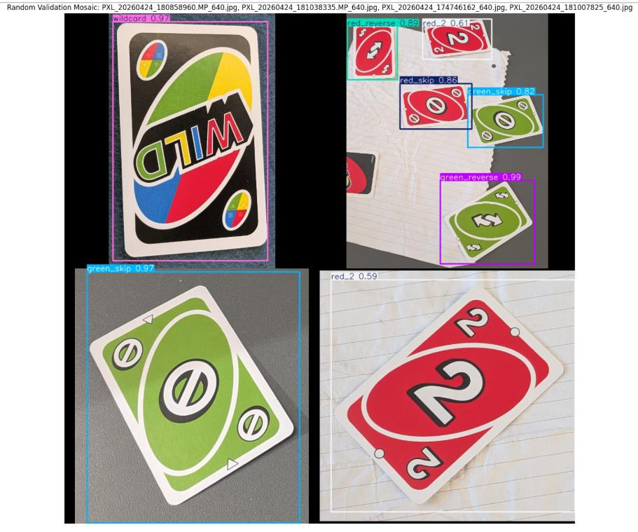
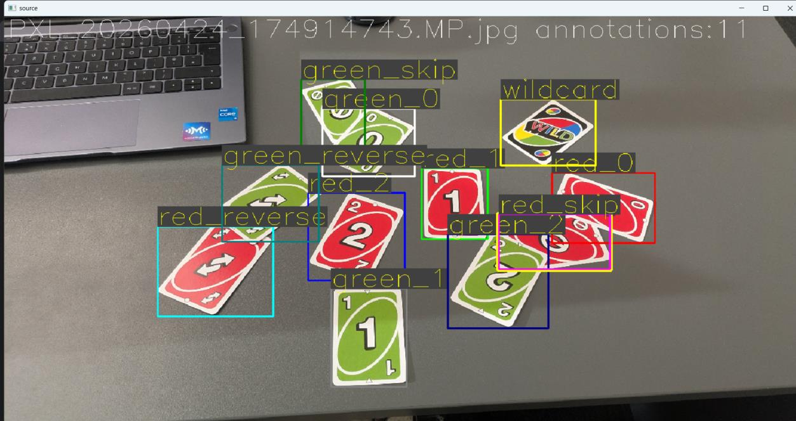
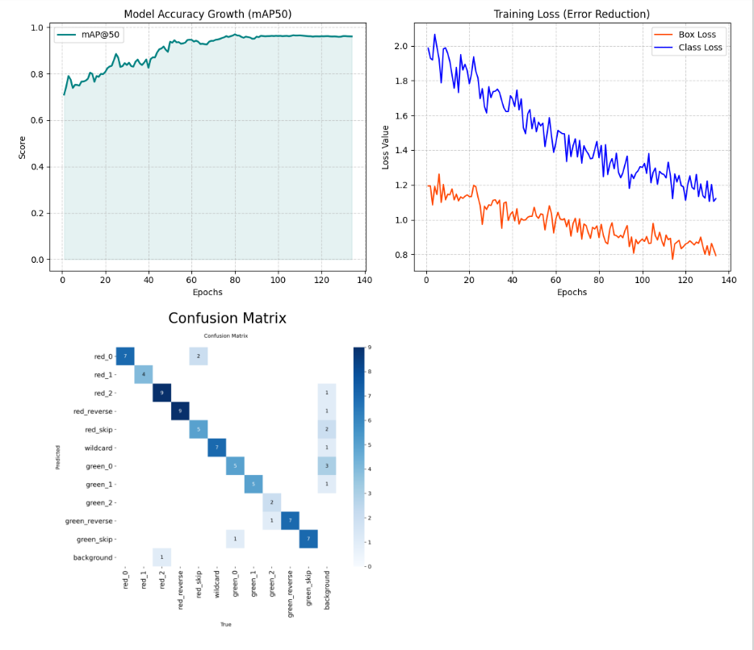
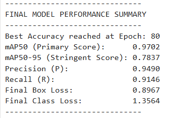
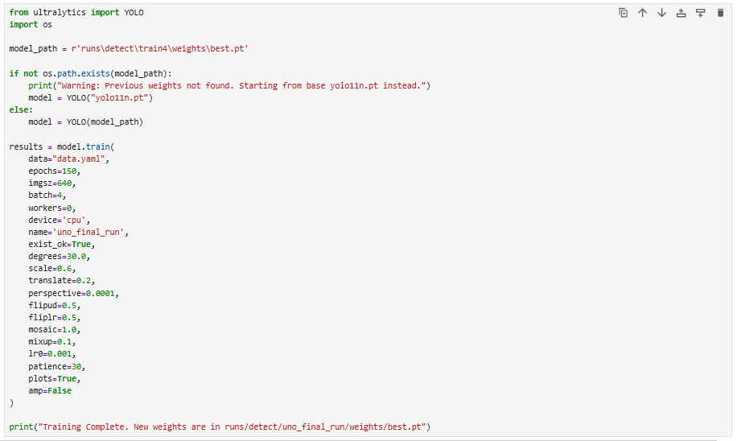

# 🃏 Autonomous UNO Card Game Cheating Detection Engine

[](https://www.python.org/)
[](https://github.com/ultralytics/ultralytics)
[](https://opencv.org/)
[](LICENSE)
[](https://github.com/CharlieAtkinson/uno-cheat-detector/releases/tag/v1.0.0)

An end-to-end computer vision and deterministic rule-verification engine that monitors video streams of UNO games, detects played cards at **~12–15 FPS on a consumer CPU**, rejects transient hand transit noise, and automatically audits illegal moves in real time.

<p align="center">
  
</p>
<p align="center"><em>Validation predictions showing multi-angle detection resilience across arbitrary card orientations and overlapping placements.</em></p>

---

## 📑 Table of Contents
- [Academic Context & Project Origin](#-academic-context--project-origin)
- [System Highlights](#-system-highlights)
- [Architecture & Processing Pipeline](#-architecture--processing-pipeline)
- [Dataset Curation & Augmentation](#-dataset-curation--augmentation)
- [Model Evaluation & Metrics](#-model-evaluation--metrics)
- [Core Engineering & Failure Mode Mitigation](#-core-engineering--failure-mode-mitigation)
- [Quickstart Guide](#-quickstart-guide)
- [Verification & Audit Log](#-verification--audit-log)
- [Automated Testing](#-automated-testing)
- [Technology Stack](#-technology-stack)
- [Contributing & Issue Reporting](#-contributing--issue-reporting)
- [License](#-license)
- [Author & Acknowledgements](#-author--acknowledgements)

---

## 🎓 Academic Context & Project Origin

This system was engineered as a capstone computer vision implementation within the *BSc Robotics and Artificial Intelligence* programme at the University of Hull.

The challenge was to move beyond textbook deep learning classification by deploying a fully functional, edge-capable referee pipeline. The system operates on unconstrained desktop video feeds, resolving real-world video noise (hand occlusions, sudden placement angles, and lighting shifts) and arbitrating game state transitions entirely on CPU without cloud infrastructure.

---

## 🎯 System Highlights

- **Edge-Optimised Detection:** Fine-tuned YOLOv11 Nano on an 11-class custom card subset, reaching **0.970 mAP@50** and **0.949 Precision** at 640px resolution.
- **Occlusion & Hand-Noise Rejection:** Dual-stage **Temporal Debounce Filter** (3-frame stability window + 5-frame grace memory) eliminates false detections caused by card placement gestures and hand transit.
- **Deterministic Rule Engine:** Decoupled Last-In-First-Out (LIFO) state machine tracking colour, numerical value, and action/wildcard precedence to detect cheating without GPU dependencies.
- **CPU-First Execution:** Inference pipeline delivering **~12–15 FPS on an 11th Gen Intel i5 CPU** without requiring dedicated CUDA hardware.

---

## 🏗️ Architecture & Processing Pipeline

```text
[ Raw Video Stream (MP4/WebM) ]
              │
              ▼
[ YOLOv11n Object Detector (imgsz=640, conf=0.50) ]
              │
              ▼ (Raw Detections & Bounding Boxes)
┌────────────────────────────────────────────────────────┐
│             Temporal Debounce Filter                   │
│  - Spatial Proximity Latch                             │
│  - 3-Frame Consecutive Confidence Gate                 │
│  - 5-Frame Transient Hand-Occlusion Grace Period       │
└─────────────────────────────┬──────────────────────────┘
                              │
                              ▼ (Stable Card ID)
┌────────────────────────────────────────────────────────┐
│             LIFO Game State Referee                    │
│  - Active Discard Pile Stack Evaluation                │
│  - Colour Matching (Red / Green)                       │
│  - Value / Action Matching (0-2, Skip, Reverse)        │
│  - Wildcard Precedence Override                        │
└─────────────────────────────┬──────────────────────────┘
                              │
                              ▼
[ Decision Logger: Comma-Separated Audit Trail (output.txt) ]
```

---

## 🏷️ Dataset Curation & Augmentation

Because standard vision benchmarks (e.g. COCO, ImageNet) lack custom playing card subsets, a specialized dataset was hand-curated to simulate unconstrained play conditions:

- **Annotation Standards:** Tight bounding boxes mapped to visible card perimeters to maximise spatial coordinate precision.
- **Class Labelling:** Mapped across 11 classes encompassing numbers (`0-2`), action cards (`reverse`, `skip`), and `wildcard` across red and green decks.
- **Augmentation Pipeline:** 4-image Mosaic synthesis for spatial card density, Mixup for overlapping transparency, and HSV colour shifts to accommodate varied room lighting.

<p align="center">
  
</p>
<p align="center"><em>Dataset curation and bounding box annotation workflow.</em></p>

---

## 📊 Model Evaluation & Metrics

The network was trained across 134 epochs (converging at Epoch 104) using early stopping (`patience=30`, `lr0=0.001`):

| Metric | Score | Diagnostic Note |
|---|---|---|
| **mAP@50** | **0.9702** | Peak convergence at Epoch 104 |
| **Precision** | **0.9490** | Minimal ghost detections during rapid movement |
| **Recall** | **0.9146** | Robust detection under acute viewing angles |
| **Colour Accuracy** | **100%** | Zero confusion between Red and Green card classes |

<p align="center">
  
</p>

<p align="center">
  
  
</p>

---

## 🔬 Core Engineering & Failure Mode Mitigation

| Diagnostic Anomaly | Root Cause Identified | Engineering Mitigation Implemented |
|---|---|---|
| **Hand Transit Occlusion** | Human hands briefly covering the discard pile during placement triggered premature state updates. | Engineered a **3-frame temporal debounce filter** requiring candidate cards to persist stably before state evaluation. |
| **Motion Blur Misclassification** | Fast card drops caused transient confusion between `red_0` and `red_skip`. | Integrated a **5-frame grace memory window** that defers state latching until card velocity drops to near zero. |
| **Acute Placement Angles** | Cards played skewed or upside down lost feature visibility. | Applied heavy mosaic synthesis and arbitrary rotation augmentations during training. |

---

## 🚀 Quickstart Guide

### 1. Installation

```bash
# Clone the repository
git clone [https://github.com/CharlieAtkinson/uno-cheat-detector.git](https://github.com/CharlieAtkinson/uno-cheat-detector.git)
cd uno-cheat-detector

# Set up virtual environment
python -m venv venv
venv\Scripts\activate

# Install dependencies
pip install -r requirements.txt
```

### 2. Model Weights
Download the pre-trained `weights.pt` file from the [v1.0.0 Release](https://github.com/CharlieAtkinson/uno-cheat-detector/releases/tag/v1.0.0) and place it into the `weights/` directory:
```bash
# Verify weights placement
weights/weights.pt
```

### 3. Run Inference

Process an input video stream and generate an official play audit log:
```bash
python main.py data/sample_game.mp4
```

Run in debug mode with live bounding boxes, frame annotations, and FPS telemetry:
```bash
python main.py data/sample_game.mp4 --debug
```

---

## 📋 Verification & Audit Log

The referee updates the active game stack and records each verified play to `output.txt` following strict comma-separated formatting:  
`filename, card_class_id, card_name, first_seen_frame, timestamp_sec, validity`

```csv
simplified_uno_01.webm,0,red_0,43,1.43,1
simplified_uno_01.webm,6,green_0,152,5.07,1
simplified_uno_01.webm,7,green_1,167,5.57,1
simplified_uno_01.webm,1,red_1,238,7.93,1
simplified_uno_01.webm,0,red_0,299,9.97,1
simplified_uno_01.webm,2,red_2,371,12.37,1
simplified_uno_01.webm,0,red_0,402,13.4,1
simplified_uno_01.webm,5,wildcard,416,13.87,1
simplified_uno_01.webm,9,green_reverse,558,18.6,0
simplified_uno_01.webm,3,red_reverse,622,20.73,0
simplified_uno_01.webm,10,green_skip,676,22.53,0
```

> **Audit Insight:** The final three entries are flagged with `validity=0`, demonstrating the deterministic referee successfully identifying and logging consecutive illegal plays according to official UNO game logic.

---

## 🧪 Automated Testing

Unit tests validate the deterministic state machine, colour-matching criteria, and temporal debouncer:

```bash
# Run the test suite
pytest tests/
```

---

## 🛠️ Technology Stack
* **Deep Learning Framework:** Ultralytics YOLOv11 Nano
* **Computer Vision & Video I/O:** OpenCV (Python), NumPy
* **Core Architecture:** Object-Oriented State Machine, LIFO Stack, Sliding Temporal Window
* **Testing:** PyTest

---

## 🤝 Contributing & Issue Reporting
1. Fork the repository.
2. Create a feature branch (`git checkout -b feat/blue-yellow-deck-support`).
3. Commit your changes (`git commit -m 'feat: add support for blue and yellow classes'`).
4. Push to the branch (`git push origin feat/blue-yellow-deck-support`).
5. Open a Pull Request detailing your changes.

---

## 📜 License
This project is licensed under the **MIT License** — see the [LICENSE](LICENSE) file for complete details.

---

## 👨‍💻 Author & Acknowledgements
* **Lead Engineer:** Charlie Atkinson ([@CharlieAtkinson](https://github.com/CharlieAtkinson))
* **Dataset & Annotations:** Curated using Roboflow
* **Detection Architecture:** Ultralytics YOLOv11