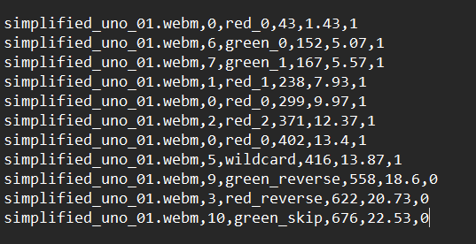

# 🃏 Autonomous UNO Card Game Cheating Detection Engine

[](https://www.python.org/)
[](https://github.com/ultralytics/ultralytics)
[](LICENSE)

An end-to-end computer vision and rule-verification system that analyses video streams of UNO games, detects played cards at ~12–15 FPS on a consumer CPU, and automatically flags illegal moves in real time.

<p align="center">
  
</p>
<p align="center"><em>Validation predictions showing multi-angle detection resilience across arbitrary card orientations and overlapping placements.</em></p>

---

## 🎯 System Highlights

- **Edge-Optimised Detection:** Fine-tuned YOLOv11 Nano on an 11-class UNO deck subset, reaching **0.970 mAP@50** and **0.949 Precision** at 640px resolution.
- **Occlusion & Hand-Noise Rejection:** Dual-stage **Temporal Debounce Filter** (3-frame stability window + 5-frame grace period) eliminates false detections caused by card placement gestures and hand transit.
- **Deterministic Rule Engine:** Decoupled LIFO state machine tracking colour, number, and wildcard precedence to detect cheating without cloud or GPU dependencies.
- **CPU-First Execution:** Inference pipeline delivering **~12 FPS on an 11th Gen Intel i5 CPU** without requiring a dedicated GPU.

---

## 🏗️ Architecture & Pipeline

```text
[ Video Stream ]
       │
       ▼
[ YOLOv11n Detection (imgsz=640, conf=0.50) ]
       │
       ▼
[ Temporal Debounce Filter ] ── (Rejects transient occlusion & hand transit)
       │ (Candidate locked after 3 consecutive stable frames)
       ▼
[ LIFO Game State Machine ]
       │ ── Colour Match?
       │ ── Value / Action Match?
       │ ── Wildcard Precedence?
       ▼
[ Decision Logger: VALID (1) / CHEAT DETECTED (0) ]
```

---

## 🏷️ Dataset Curation & Augmentation

Because standard benchmark datasets lack custom card gameplay subsets, a tailored dataset of high-resolution captures was hand-curated:
- **Annotation Standards:** Tight bounding boxes around visible card boundaries to optimise spatial coordinate precision.
- **Class Labelling:** Mapped to 11 custom classes encompassing numeric values (`0-2`), action cards (`reverse`, `skip`), and `wildcard` across red and green variants.
- **Augmentations Applied:** 4-image Mosaic synthesis for card density, Mixup for overlapping card transparency, and HSV shifts to handle real-world lighting variations.

<p align="center">
  
</p>
<p align="center"><em>Dataset curation and bounding box annotation workflow.</em></p>

---

## 📊 Model Evaluation & Metrics

The model was trained over 134 epochs (best checkpoint converged at Epoch 104) with an early-stopping configuration (`patience=30`, `lr0=0.001`):

| Metric | Score | Note |
|---|---|---|
| **mAP@50** | **0.9702** | Peak convergence at Epoch 104 |
| **Precision** | **0.9490** | Minimal ghost detections |
| **Recall** | **0.9146** | Robust detection under acute angles |
| **Colour Accuracy** | **100%** | Zero confusion between Red and Green classes |

<p align="center">
  
</p>

<p align="center">
  
  
</p>

> **Edge-Case Insight:** Rapid card placement created occasional motion blur between `red_0` and `red_skip`. The 3-frame temporal debounce filter neutralises this by deferring state updates until motion stops on the play stack.

---

## 🚀 Quickstart

### 1. Installation
```bash
git clone [https://github.com/CharlieAtkinson/uno-cheat-detector.git](https://github.com/CharlieAtkinson/uno-cheat-detector.git)
cd uno-cheat-detector
python -m venv venv
venv\Scripts\activate
pip install -r requirements.txt
```

### 2. Model Weights
Download `weights.pt` from the [v1.0.0 Release](https://github.com/CharlieAtkinson/uno-cheat-detector/releases/tag/v1.0.0) and place it inside the `weights/` directory.

### 3. Run Inference
Process a video file to output the play audit trail:
```bash
python main.py data/sample_game.mp4
```

Run with visual bounding boxes and live detection output:
```bash
python main.py data/sample_game.mp4 --debug
```

---

## 📋 Verification & Audit Log

The referee updates the game state and writes each verified play to `output.txt` following strict comma-separated formatting:
`filename, card_class_id, card_name, first_seen_frame, timestamp_sec, validity`

<p align="center">
  
</p>

```csv
simplified_uno_01.webm,0,red_0,43,1.43,1
simplified_uno_01.webm,6,green_0,152,5.07,1
simplified_uno_01.webm,7,green_1,167,5.57,1
simplified_uno_01.webm,1,red_1,238,7.93,1
simplified_uno_01.webm,0,red_0,299,9.97,1
simplified_uno_01.webm,2,red_2,371,12.37,1
simplified_uno_01.webm,0,red_0,402,13.4,1
simplified_uno_01.webm,5,wildcard,416,13.87,1
simplified_uno_01.webm,9,green_reverse,558,18.6,0
simplified_uno_01.webm,3,red_reverse,622,20.73,0
simplified_uno_01.webm,10,green_skip,676,22.53,0